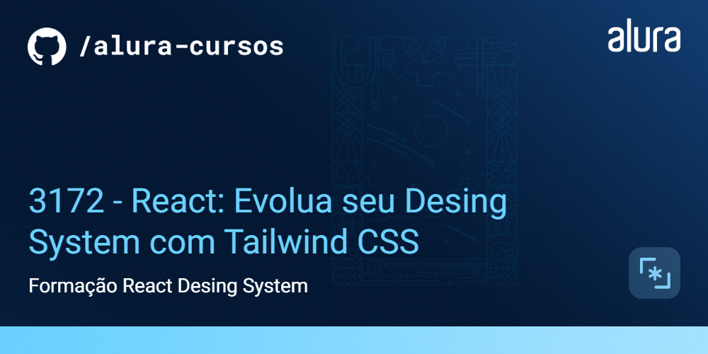

# Alfabit

A Alfabit é uma inovadora empresa de tecnologia dedicada a fornecer soluções criativas e eficientes para seus clientes. Reconhecendo a importância do design consistente e intuitivo em todas as suas plataformas e produtos, a Alfabit decidiu investir em um design system de ponta.

## 🛠️ Instalação

```bash
$ npm install
$ //ou
$ yarn add
```


## ✔️ Técnicas e tecnologias utilizadas


- `React`
- `Next js`
- `Tailwind CSS`
- `Storybook`
- `Class Variance Authority (cva)`


## 🛠️ Abrir e rodar o projeto

Após clonar ou baixar o projeto, instale as dependências, abra na sua IDE e digite no terminal `npm run storybook` e acesse a url mostrada no terminal.

